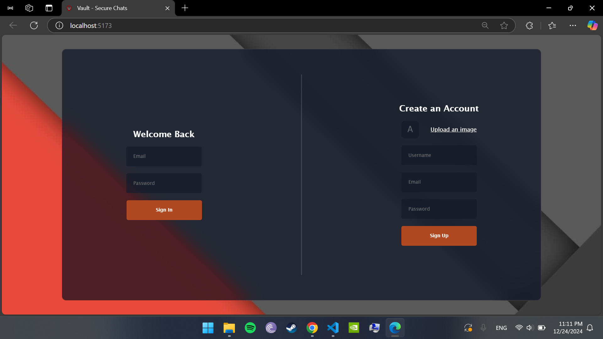
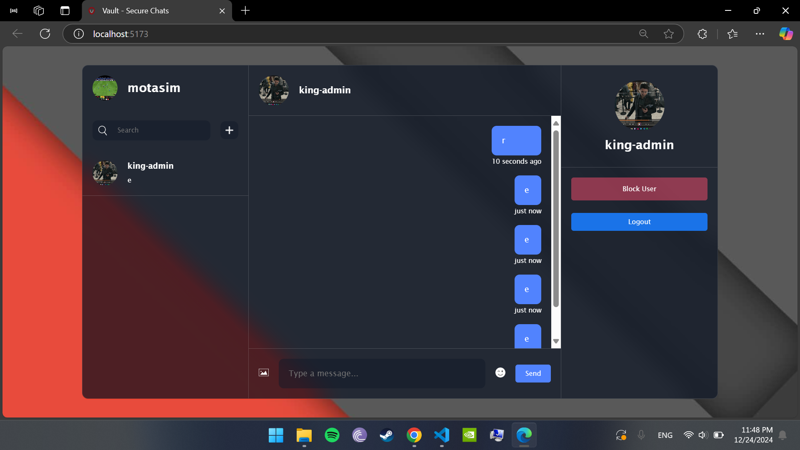

# Vault Chat App (React Version)

A real-time chatting application built using **React** and **Vite**, originally created as part of my graduation project. It features a clean UI, efficient development workflow, and Firebase for backend services.

> ⚠️ This project has been succeeded by a new, advanced version built with **React Native** and **Expo** to provide a much better experience across **mobile and web** platforms. Check it out here:  
👉 [Advanced Vault Chat App (React Native + Expo)](https://github.com/mxtasim/Advanced-Vault-App)


---

## 🚀 Getting Started

```bash
npm install       # Install dependencies
npm run dev       # Start development server
```

---

## ✅ Features Implemented

- Chat messages sent by pressing Enter
- Notification sounds on new messages
- User avatar customization
- Website branding with logo and developer details
- User duplication prevention
- Chat layout enhancements
- Professional-looking notifications

---

## 🧩 Upcoming Features

- Responsive design for mobile/tablet support
- Google authentication
- Seen/Read visibility on messages
- Full-screen image viewing with close functionality
- Clear chat history feature
- Display message for invalid users
- Fix: Login requires page refresh to access chat

---

## ⚙️ Additional Notes

- Compression planned (some parts may already be partially integrated)
- Some features are under development or planned for future updates
---

## 📸 Screenshots

<div align="center">
  
  
</div>
